# seb39_main_051

코드스테이츠 seb39_main_051팀 

매일 아침 면접 질문을 이메일로 받아보는 구독 서비스 - 매일 메일

## 시연화면

### 랜딩 페이지

   
  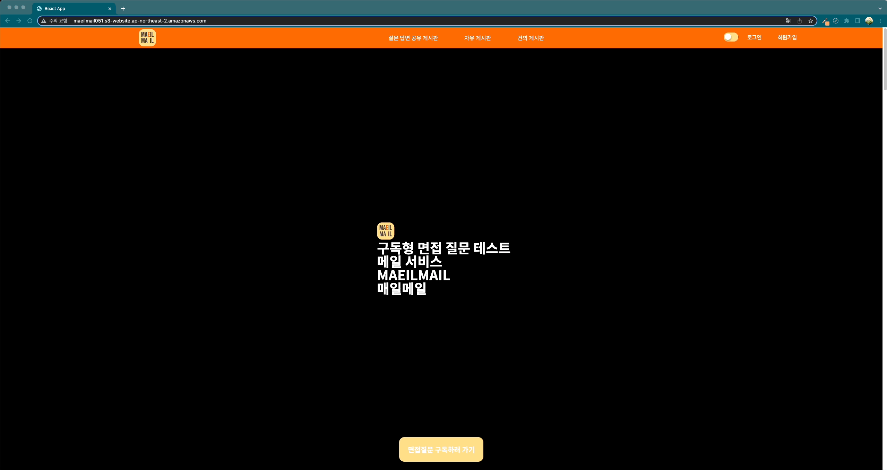
   

### 회원 가입

   
  
   

### 로그인

   
  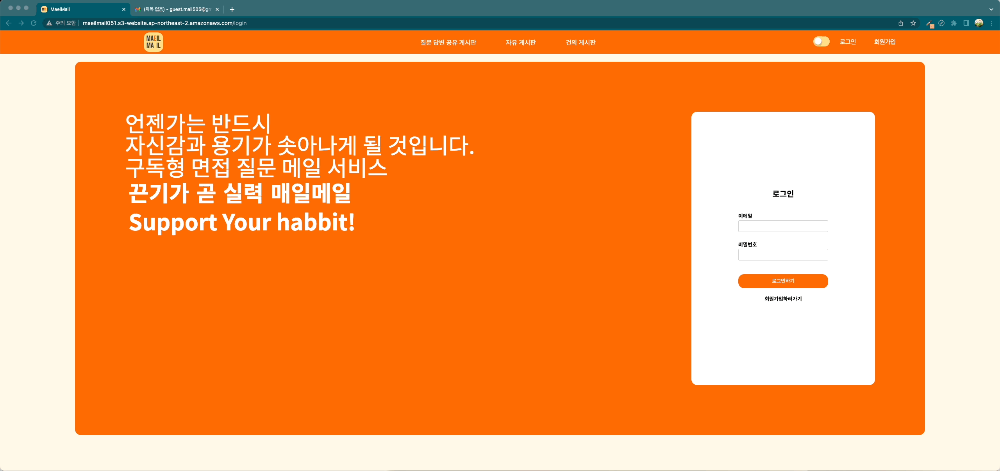
   

### 구독페이지

   
  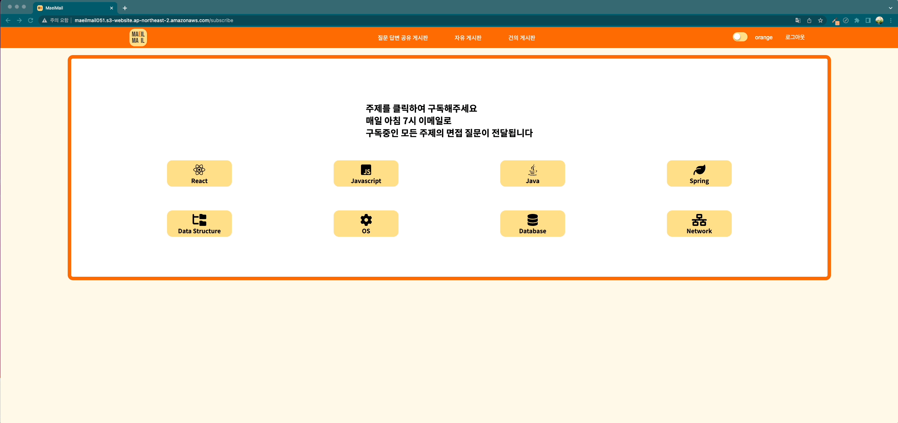
   

### 메일 확인

   
  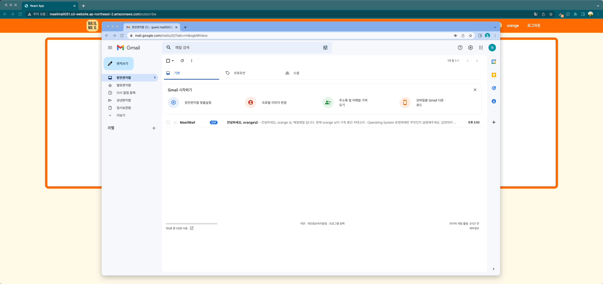
   

### 질문 답변 게시판

   
  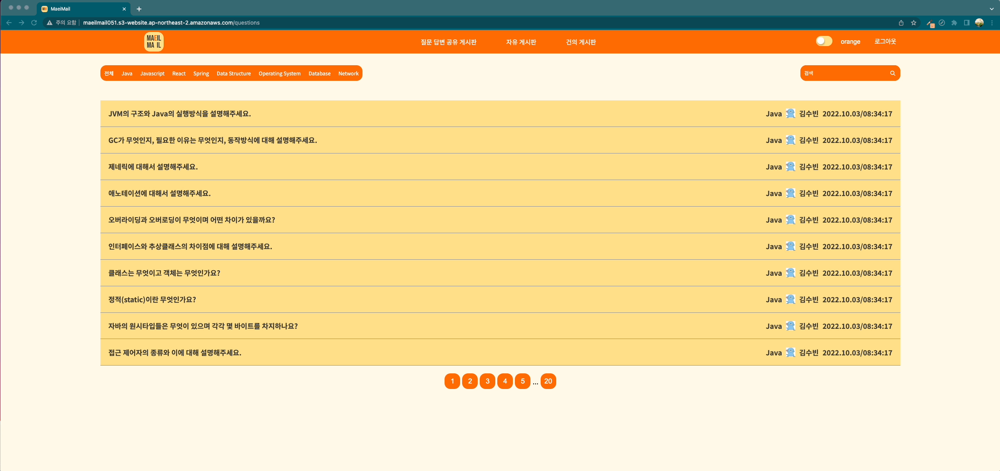
   

### 답변 페이지

   
  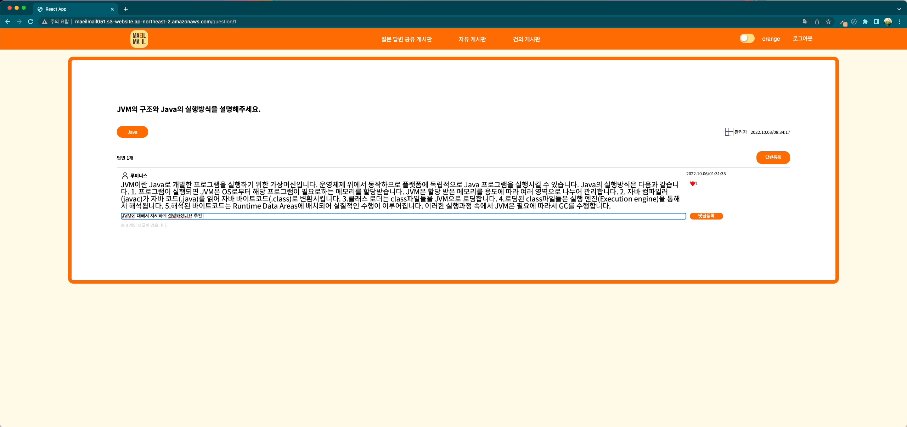
   

### 자유 게시판

   
  
   

### 건의 게시판

   
  
   

### 게시글 작성 화면

   
  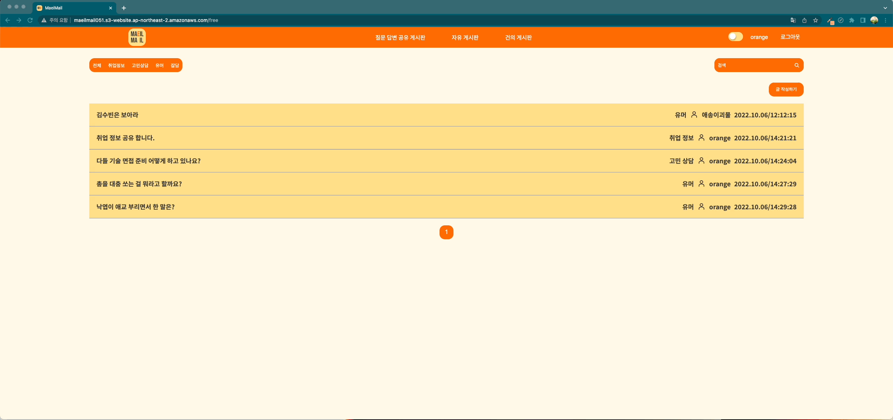
   

### 마이 페이지 - 대시보드

   
  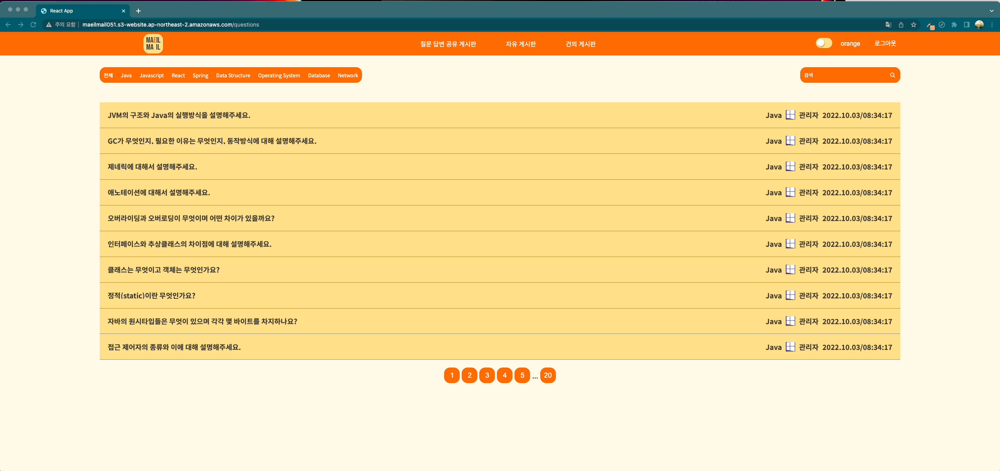
   

### 마이 페이지 - 프로필 사진 변경

   
  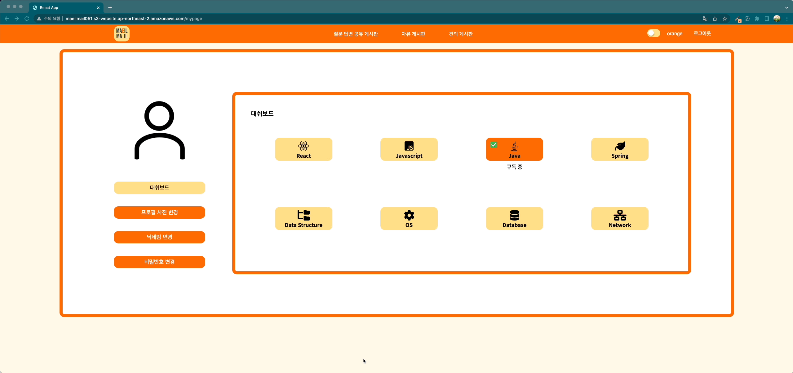
   

### 마이 페이지 - 닉네임 변경 변경

   
  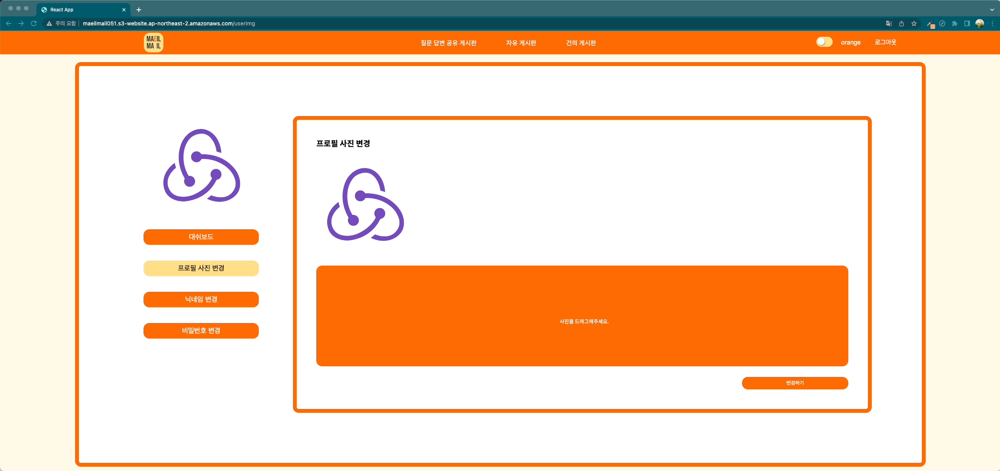
   

### 마이 페이지 - 비밀 번호 변경

   
  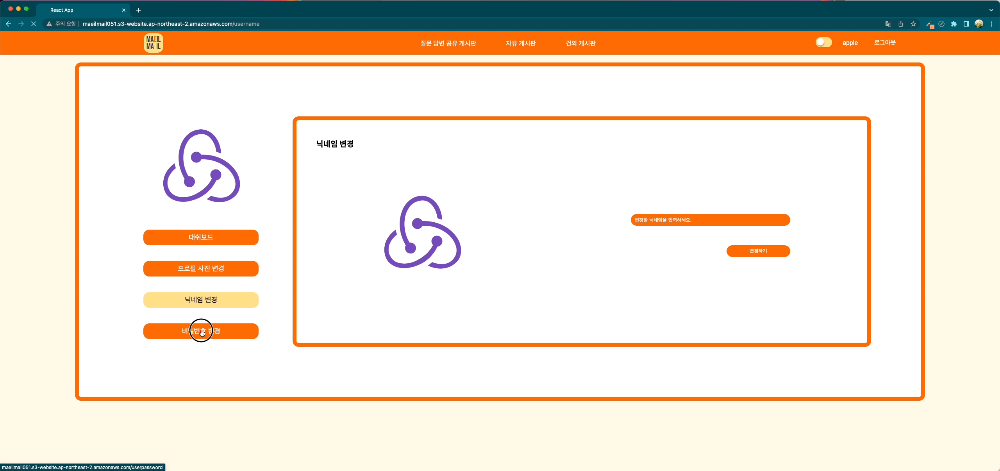
   

## 프로젝트 요약

기술 면접 대비를 위한 예상 질문을 매일 메일을 보내주는 서비스입니다.

회원 가입 후에 카테고리를 선택하여 구독하면 매일 아침 7시에 해당 카테고리에 해당되는 예상 기술 면접 질문을 받을 수 있습니다.

예상 질문에 대한 답변을 작성할 수 있는 게시판과 서비스 이용자들이 서로 이야기할 수 있는 자유게시판, 서비스에 대한 건의사항을 작성할 수 있는 건의 게시판이 있습니다.

## 프로젝트 목표

- 프론트엔드와 백엔드 소통 연습하기
  
- 클론 코딩이 아닌 새로운 서비스를 실제로 배포하여 다른 사람들이 직접 사용할 수 있게 만들기
  

## 기간

- 5주 : 2022.09.07(수) ~ 2022.10.12(수)

## 팀 소개

| [한정윤](https://github.com/JungYunHan) | [이창훈](https://github.com/anotheranotherhoon) | [김충섭](https://github.com/kchs94) | [김수빈](https://github.com/soobinkim-kor) |
| :---: | :---: | :---: | :---: |
|  |  |  |  |
| Frontend(팀장) | Frontend | Backend | Backend |

## 기술 스택

### FrontEnd

- `HTML`
- `CSS`
- `Javascript`
- `React`
- `Redux Toolkit`
- `Styled Components`
- `Axios`
- `Toast`
- `React Scroll Motion`

### **BackEnd**

- `Java 11`
- `Gradle 7.4.2`
- `Spring Boot 2.7.3`
- `H2`
- `MySQL`
- `Spring Data JPA`
- `Spring Security`
- `JWT`
- `Spring Validation`
- `Lombok`
- `Mapstruct`
- `Swagger`
- `Google SMTP`

### **배포**
- `AWS EC2`
- `AWS amplify`
- `AWS S3`

### **문서/협업**

- `Github Projects`
  - `Issue`
  - `Milestones`
- `Git`
- `Slack`
- `Zoom`

### 브랜치 전략

- `git flow`
  
  - main : 운영환경에서 사용되는 브랜치입니다.
    
  - dev: 개발환경에서 사용되는 브랜치입니다.
    
  - feat: 기능을 개발할 때 사용되는 브랜치입니다.
    

## 기능 정의

- 회원가입
  
- 토큰을 이용한 유저 판별
  
- 로그인/로그아웃

- 프로필 사진, 프로필 닉네임, 비밀번호 수정 
  
- 유저 등록, 수정, 조회

- 질문 등록, 수정, 삭제, 조회

- 답변 등록, 수정, 삭제, 조회

- 댓글 등록, 수정, 삭제, 조회

- 게시판 페이징

- 게시글 검색

- Light/Dark 모드

- 질문, 답변 좋아요

- 회원 구독 카테고리 메일 전송

## API 문서
회원 관련 API
https://documenter.getpostman.com/view/21358738/2s83mbpjZN

게시글 관련 API
https://documenter.getpostman.com/view/15776280/2s83maLkak

## Figma
https://www.figma.com/file/b2KuIpCLIvchUL8sai0pQE/Untitled?node-id=0%3A1

## 엔티티 클래스 다이어그램
https://app.diagrams.net/#G11KQgu9tFPHk1Sj8x9bjyvWXCxsZWwf6V 
